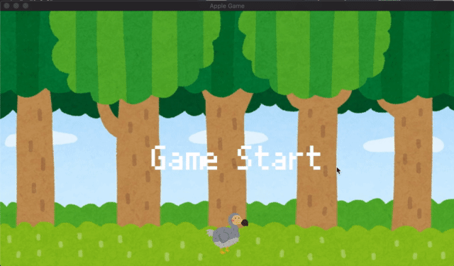

# bevy_simple_game
sample 2D game by [Bevy](https://bevyengine.org/) 



# Requirement
 
* bevy 0.5.0
* rand 0.8.0

# Running the game

```bash
# Clone the repo
git clone https://github.com/Nitudon/bevy_simple_game.git
cd bevy_simple_game

# Run
cargo run 

```

# Control
Left key : Move left
Right key : Move right

# Credits
Texture: [いらすとや](https://www.irasutoya.com/)
Font: [PixelMplus10-Regular.ttf](https://itouhiro.hatenablog.com/entry/20130602/font)
